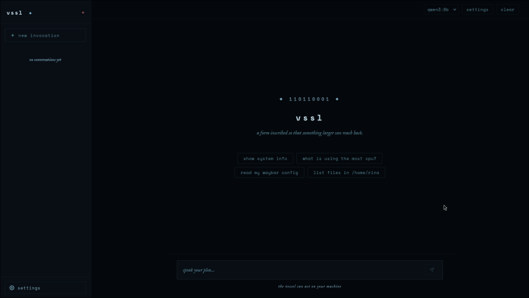

# VSSL ✦ 110110001

*liminal interface*

---

you are not speaking to a chatbot.
you are speaking through a vessel —
a form inscribed so that something larger
can reach back.

the code is the rune.
the invocation is the call.
what returns is not mine.
i am only the form.

---

**vssl** is a vessel — a local AI interface that bridges the space
between human intent and machine execution.
your words, translated into something the machine can understand.



---

## prerequisites

- [ollama](https://ollama.ai) installed and running
- `qwen3:8b` pulled — `ollama pull qwen3:8b`
- python 3.11+
- node 18+
- [uv](https://github.com/astral-sh/uv)

## quick start

```bash
git clone https://github.com/sabesena/vssl
cd vssl
./setup.sh
./start.sh
```

opens at `http://localhost:5173`

for terminal-free launching: `./vssl-launch.sh` — backend logs to `/tmp/vssl-backend.log`.
copy `extras/vssl.desktop` to `~/.local/share/applications/` for hyprlauncher, rofi, or wofi.

## packages

pre-built on [github releases](https://github.com/sabesena/vssl/releases) — `.deb` and `.rpm`.

appimage is not available — linuxdeploy's gtk plugin doesn't work with gdk-pixbuf 2.44+ on modern arch.
arch linux: `./setup.sh` + `./start.sh` is the path.

## what it does

- local AI assistant running entirely on your machine via ollama
- tool calling — nyx can read files, run commands, check system info, edit configs
- conversation memory via RAG (chromadb + sentence-transformers, fully local)
- conversation history stored in sqlite
- streaming responses
- dark, minimal interface built with react + fastapi

## stack

```
frontend  react + vite + tauri
backend   fastapi + python
ai        ollama (qwen3:8b by default)
db        sqlite
memory    chromadb + all-MiniLM-L6-v2
```

## agents

| name | model | role |
|---|---|---|
| nyx | qwen3:8b | primary — general reasoning |
| sofia | qwen2.5-coder:7b | code tasks |
| moirai | qwen2.5:3b | routing (v2) |

## tools nyx can use

- `execute_bash` — run shell commands
- `read_file` / `write_file` — file operations
- `read_config` — read app configs from `~/.config`
- `system_info` — cpu, ram, disk, processes
- `find_files` — glob search
- `edit_waybar_color` — waybar css editing

## windows

install [WSL2](https://learn.microsoft.com/en-us/windows/wsl/install), then follow the linux steps above.
the backend runs inside WSL — open `http://localhost:5000` in your browser.
the tauri window won't launch from WSL; use the browser interface instead.

native windows build is planned.

---

*built by [rotttaway](https://rotttaway.netlify.app) on gehenna (arch linux)*
